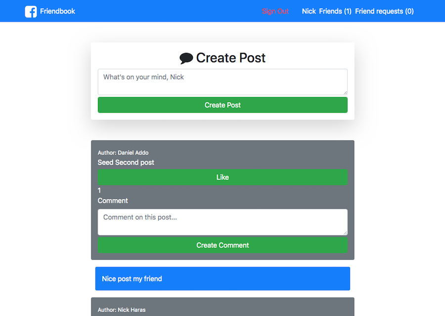

# Project Facebook Clone

Welcome to Friendbook. In this project, we recreated the basic functionality of facebook. This is the last project of Microverse's Rails curriculum.

### Features

- Users

  - Sign up using their real facebook account
  - Create/delete posts
  - Like posts
  - Comment on posts
  - Send and accept friendship requests
  - Remove friends

### Screenshot



### Requirements

```
- A Cloud Server running Linux (Ubuntu 18.04) or (Mac OS)
- PostgreSQL installed and running.
- Ruby 2.6.4
- Rails 5.2.3
- A basic familiarity with Ruby on Rails

```

### Gems

- gem 'devise', '~> 4.7', '>= 4.7.1'
- gem 'faker', '~> 1.6', '>= 1.6.6'
- gem 'font-awesome-sass'
- gem 'omniauth-facebook', '~> 5.0'
- gem 'pg', '>= 0.18', '< 2.0'
- gem 'rails', '~> 5.2.3'

#### Optional

- gem hirb

### Installation

Clone or download this repository to your local machine. After cloning open your terminal on the repository folder and run :

```
bundle install
rails db:create
rails db:migrate
rails db:seed
```

👤 **Author1**

- Github: [@macnick](https://github.com/macnick)
- Twitter: [@mac_experts](https://twitter.com/mac_experts)
- Linkedin: [Nick Haralampopoulos](https://www.linkedin.com/in/nick-haralampopoulos-26a55412a/)

👤 **Author2**

- Github: [@addod19](https://github.com/addod19)
- Twitter: [@DanielLarbiAdd1](https://twitter.com/DanielLarbiAdd1)
- Linkedin: [Daniel Larbi Addo](https://linkedin.com/in/daniel-larbi-addo-9738b0128/)

## 🤝 Contributing

Contributions, issues and feature requests are welcome!

Feel free to check the [issues page](https://github.com/macnick/facebook-clone/issues).

## Show your support

Give us a ⭐️ if you like this project!

## 📝 License

This project is [MiT](LICENSE) licensed.

```

```
